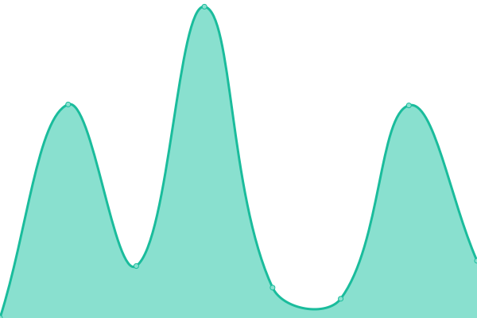

# [📈 Live Status](https://status.testomat.io): <!--live status--> **🟩 All systems operational**

This repository contains the open-source uptime monitor and status page for [Testomatio](https://testomat.io), powered by [Upptime](https://github.com/upptime/upptime).

With [Upptime](https://upptime.js.org), you can get your own unlimited and free uptime monitor and status page, powered entirely by a GitHub repository. We use [Issues](https://github.com/testomatio/status/issues) as incident reports, [Actions](https://github.com/testomatio/status/actions) as uptime monitors, and [Pages](https://status.testomat.io) for the status page.

<!--start: status pages-->
<!-- This summary is generated by Upptime (https://github.com/upptime/upptime) -->
<!-- Do not edit this manually, your changes will be overwritten -->
<!-- prettier-ignore -->
| URL | Status | History | Response Time | Uptime |
| --- | ------ | ------- | ------------- | ------ |
|  [Landing Page](https://testomat.io) | 🟩 Up | [landing-page.yml](https://github.com/testomatio/status/commits/HEAD/history/landing-page.yml) | 

 927ms
     
 | 

<a href="https://status.testomat.io/history/landing-page">100.00%</a>
    

|  [Testomatio App](https://app.testomat.io/users/sign_in) | 🟩 Up | [testomatio-app.yml](https://github.com/testomatio/status/commits/HEAD/history/testomatio-app.yml) | 

 328ms
     
 | 

<a href="https://status.testomat.io/history/testomatio-app">100.00%</a>
    

|  [Jira Plugin](https://jira.testomat.io/) | 🟩 Up | [jira-plugin.yml](https://github.com/testomatio/status/commits/HEAD/history/jira-plugin.yml) | 

 119ms
     
 | 

<a href="https://status.testomat.io/history/jira-plugin">100.00%</a>
    

|  [App Assets](https://app-assets.testomat.io/assets/frontend.css) | 🟩 Up | [app-assets.yml](https://github.com/testomatio/status/commits/HEAD/history/app-assets.yml) | 

 449ms
     
 | 

<a href="https://status.testomat.io/history/app-assets">100.00%</a>
    

|  [Testomatio Cloud](https://cloud.testomat.io/users/sign_in) | 🟩 Up | [testomatio-cloud.yml](https://github.com/testomatio/status/commits/HEAD/history/testomatio-cloud.yml) | 

 339ms
     
 | 

<a href="https://status.testomat.io/history/testomatio-cloud">100.00%</a>
    

|  [Testomatio Beta](https://beta.testomat.io/users/sign_in) | 🟩 Up | [testomatio-beta.yml](https://github.com/testomatio/status/commits/HEAD/history/testomatio-beta.yml) | 

 332ms
     
 | 

<a href="https://status.testomat.io/history/testomatio-beta">81.08%</a>
    

|  [Beta Assets](https://frontend.testomat.io/assets/frontend.css) | 🟩 Up | [beta-assets.yml](https://github.com/testomatio/status/commits/HEAD/history/beta-assets.yml) | 

 503ms
     
 | 

<a href="https://status.testomat.io/history/beta-assets">100.00%</a>
    

<!--end: status pages-->

[**Visit our status website →**](https://status.testomat.io)

## 📄 License

- Powered by: [Upptime](https://github.com/upptime/upptime)
- Code: [MIT](./LICENSE) © [Testomatio](https://testomat.io)
- Data in the `./history` directory: [Open Database License](https://opendatacommons.org/licenses/odbl/1-0/)
